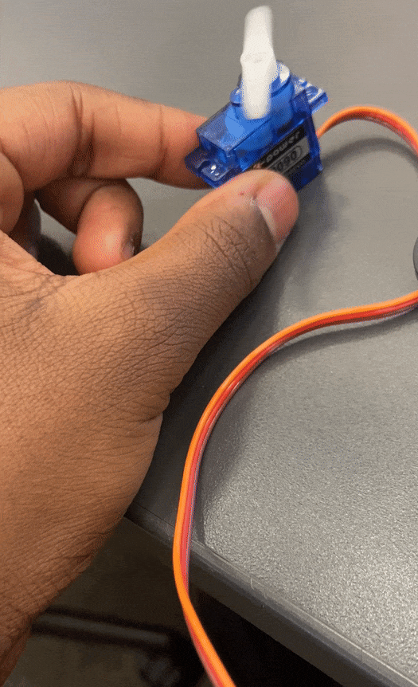

# CircuitPython
My python notebook
# CircuitPython
This repository will actually serve as a aid to help you get started with your own template.  You should copy the raw form of this readme into your own, and use this template to write your own.  If you want to draw inspiration from other classmates, feel free to check [this directory of all students!](https://github.com/chssigma/Class_Accounts).
## Table of Contents
* [Table of Contents](#TableOfContents)
* [Hello_CircuitPython](#Hello_CircuitPython)
* [CircuitPython_Servo](#CircuitPython_Servo)
* [CircuitPython_PhotoResistor](#CircuitPython_PhotoResistor)
* [CircuitPython DistanceSensor](#CircuitPython_DistanceSensor)

 


## Hello_CircuitPython

### Description & Code
Description goes here


### Evidence


### Wiring
Make an account with your google ID at [tinkercad.com](https://www.tinkercad.com/learn/circuits), and use "TinkerCad Circuits to make a wiring diagram."  It's really easy!  
Then post an image here.   [here's a quick tutorial for all markdown code, like making links](https://guides.github.com/features/mastering-markdown/)

### Reflection
What went wrong / was challenging, how'd you figure it out, and what did you learn from that experience?  Your ultimate goal for the reflection is to pass on knowledge that will make this assignment better or easier for the next person.


## CircuitPython_Servo

### Description & Code
Using a metro board and circuit python I programed a micro servo to turn 0 and 180°.


```python
from adafruit_motor import servo
import time
import board
import pwmio


# create a PWMOut object on Pin A2.
pwm = pwmio.PWMOut(board.A2, frequency=50)

# Create a servo object, my_servo.
my_servo = servo.ContinuousServo(pwm)

while True:
    print("forward")
    my_servo.throttle = 1.0
    time.sleep(2.0)
    print("stop")
    my_servo.throttle = 0.0
    time.sleep(2.0)
    print("reverse")
    my_servo.throttle = -1.0
    time.sleep(2.0)
    print("stop")
    my_servo.throttle = 0.0
    time.sleep(4.0)
```


### Evidence


### Wiring


### Reflection
I struggled with my code, but turns out it was just that I wired my servo wrong.

## CircuitPython Cap touch

### Description & Code

```
import time
import board
import pwmio
from adafruit_motor import servo

# create a PWMOut object on Pin A2.
pwm = pwmio.PWMOut(board.A2, frequency=50)

# Create a servo object, my_servo.
my_servo = servo.ContinuousServo(pwm)

while True:
    print("forward")
    my_servo.throttle = 1.0
    time.sleep(2.0)
    print("stop")
    my_servo.throttle = 0.0
    time.sleep(2.0)
    print("reverse")
    my_servo.throttle = -1.0
    time.sleep(2.0)
    print("stop")
    my_servo.throttle = 0.0
    time.sleep(4.0)
```

### Evidence


### Wiring

### Reflection
This code was pretty easy to get the hang of. I think I got help from Ben, so credits to him for half of my code.


## CircuitPython_Distance Sensor

### Description & Code
This code allows an ultrasonic sensor to fade from from red, to blue, to green when you move your hand or an object in front of it.

```
import time
import board
import adafruit_hcsr04
import neopixel
import simpleio


dot = neopixel.NeoPixel(board.NEOPIXEL, 1, brightness = 0.1)

sonar = adafruit_hcsr04.HCSR04(trigger_pin=board.D5, echo_pin=board.D6)
cm = 0

while True:
    try:
        cm = sonar.distance
        print((cm,))
        if cm < 5:
            print("Red")
            r = 209
            g = 0
            b = 0


        elif cm < 20:
            print("not red")
            r = int(simpleio.map_range(cm, 5, 20, 209, 0))
            g = 0
            b = int(simpleio.map_range(cm, 5, 20, 0, 209))

        elif cm > 20:
            print("not red or blue")
            r = 0
            g = int(simpleio.map_range(cm, 20, 35, 0, 209))
            b = int(simpleio.map_range(cm, 20, 35, 209, 0))


        dot.fill((r, g, b))

    except RuntimeError:
        print("Retrying!")
    time.sleep(0.1)

```

### Evidence

Credits to - Jai Aust
### Wiring


### Reflection
The hardest part about this was getting the colors to fade. I was confused on the distance and how to incorporate it into code.


## NextAssignment

### Description & Code

```python
Code goes here

```

### Evidence

### Wiring

### Reflection
